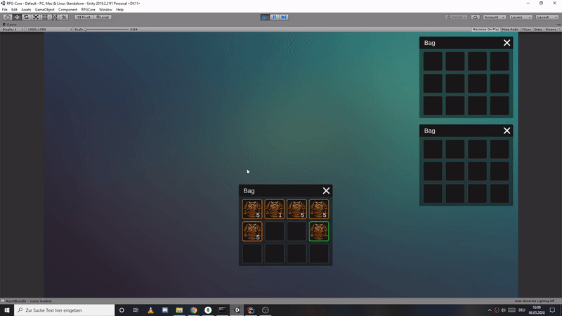
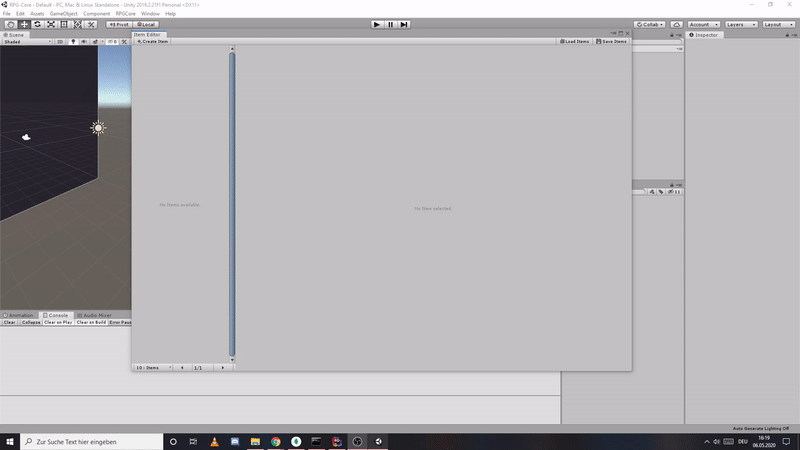

# RPG Core
 
> Exploring different mechanics that are common in (mmo)rpg's.

 ## Technologies  
* Unity 2019.2.21f1  
* MonogoDB 
* Asset Bundle Browser
  
## Setup  
Mongo Libs(dll) are included. Just need to install a [Mongo-Server](https://www.mongodb.com/download-center/community "Mongo-Server") to create a DB.  
Asset Bundle Browser is also recommended.  

## Features

#### Inventory
> Item management, drag n drop, stacking, preview  
> dragable windows  

  

#### Item Editor
> load & save via database  
> create, update, delete items  

#### Database
> wrapper for a quick access  
#### AssetBundle
> wrapper for a simpler access  
> asset data-model to load asset when needed and simplify serialization/deserialization 
  
